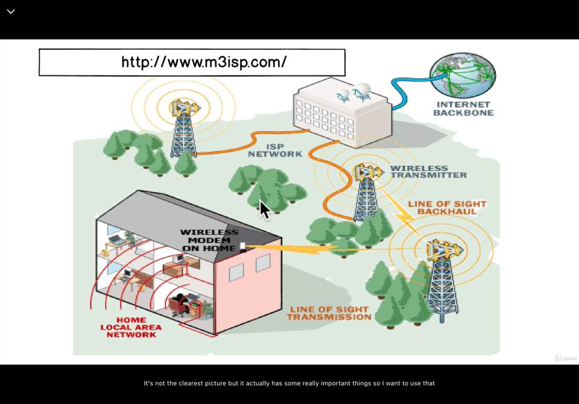
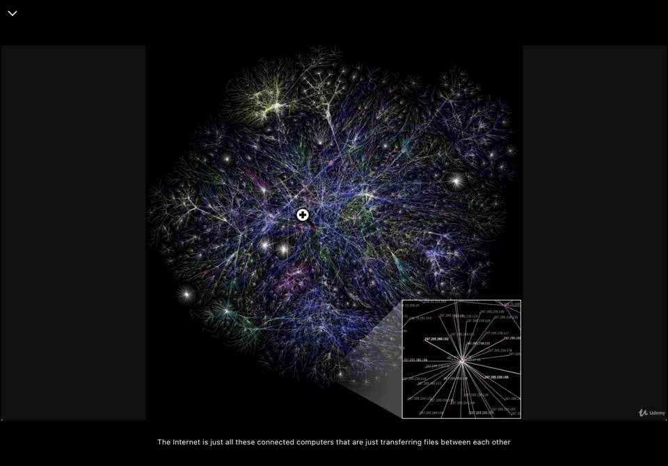

1. Browsing The Web
    My laptop -> Web -> 'google.com' -> Enter
   1. Who is this google.com fellow? brower request -> ISP
   2. ISP: Internet Service Provieder
   3. ISP -> DNS server
   4. DNS server: Domain Name Servers, like Phone book that has the list of all these URLs
   5. DNS -> ISP - I don't know him personally, but here is his address 172.217.7.23(IP address)
   6. broweser another request(IP address) -> Google servers
   7. Google Servers -> HTML CSS and Javascript
    - 검색창에 'google.com'검색 = 바로 Google Server에 접속(IP address)
    - 두 방법 모두 구글 페이지 접속 확인됨.
    - 차이: DNS를 통해 IP Address를 가져오는 과정 생략 여부
    
    

2. Breaking Google
    - Chrome 개발자도구 - value 변경, body 삭제 등 수정 가능(HTML,CSS,Javascript부분)
    - Google Server 자체에 영향X
  
3. Exercise: Break Google Yourself: 개발자도구를 활용해서 편한대로 바꿔보기.

4. The Internet Backbone
    - What Do The Arrows Mean?
      - send off IP address to the servers the server responds with some files(HTML,CSS,Javascript)
    
    - Internet Map
      - The Opte Project
      - The Internet is all these connected computers that are transferring files between each other
    

5. Traceroute
    - can moniter, can see all IP addresses are different computers, that are trying to locate the website servers
    - Terminal or CMD
      - Mac: traceroute 'website address'
      - Windows: tracert 'website address'
    ``` 
        ~/Desktop> tracert google.com

        최대 30홉 이상의
        google.com [172.217.174.110](으)로 가는 경로 추적:

          1     2 ms     2 ms     1 ms XXX.XX.X.XXX <- 내컴퓨터IP
          ...
           21   207 ms   193 ms   200 ms  nrt12s28-in-f14.1e100.net [172.217.174.110] <-Google Server

        추적을 완료했습니다.
    ```
  
6. Exercise: Running traceroute
    - https://www.inmotionhosting.com/support/website/hot-to/read-traceroute
    - 자료와 실행결과가 다른 경우: IP address가 IPv6이기 때문, IPv4 hops로 강제 시켜주면 됨.
      - 예시: tracert -4 google.com
    - * 표시: Timeout -> Internet connection or widespread use of firewalls and other security practices by the company that own that server 

7.  