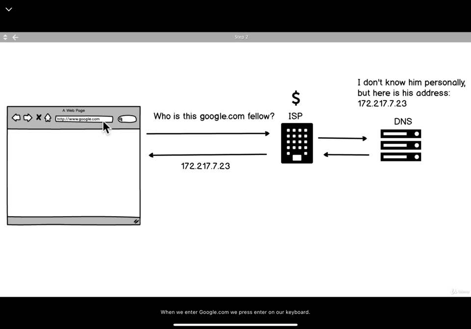
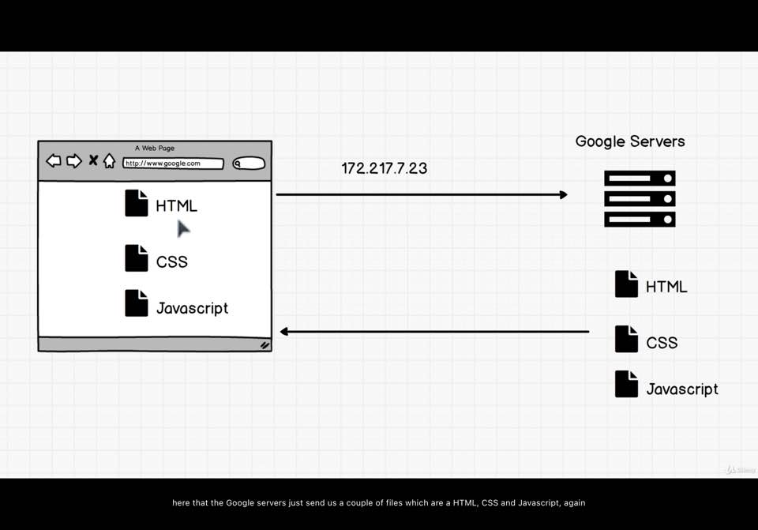

1. Browsing The Web
    My laptop -> Web -> 'google.com' -> Enter
   1. Who is this google.com fellow? brower request -> ISP
   2. ISP: Internet Service Provieder
   3. ISP -> DNS server
   4. DNS server: Domain Name Servers, like Phone book that has the list of all these URLs
   5. DNS -> ISP - I don't know him personally, but here is his address 172.217.7.23(IP address)
   6. broweser another request(IP address) -> Google servers
   7. Google Servers -> HTML CSS and Javascript
    - 검색창에 'google.com'검색 = 바로 Google Server에 접속(IP address)
    - 두 방법 모두 구글 페이지 접속 확인됨.
    - 차이: DNS를 통해 IP Address를 가져오는 과정 생략 여부
    
    

2. Breaking Google
    - Chrome 개발자도구 - value 변경, body 삭제 등 수정 가능(HTML,CSS,Javascript부분)
    - Google Server 자체에 영향X
  
3. Exercise: Break Google Yourself: 개발자도구를 활용해서 편한대로 바꿔보기.

4. 