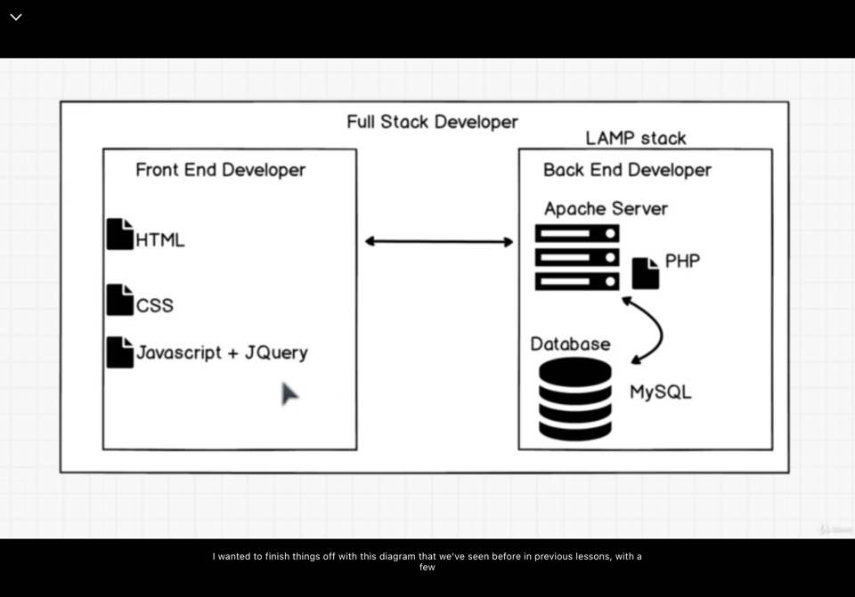
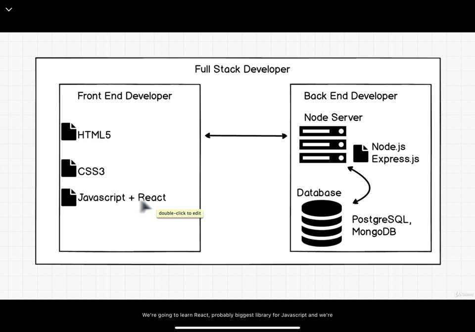

### 1. WWW vs Internet
- What problems we had in the past
- We found solutions to thoese problems and we are at now

#### Tim Berners-Lee
  - invented the World Wide Web in 1898
  - first web developer
  - create the first browser and the first server in 1991
  - created this ability for people to communicate and link to other documents
#### World Wide Web(WWW)
  - essentially a common language that computers can speak
  - Internet as your phone and the World Wide Web is Instagram that runs on your phone 
  - essentially a decentralized application

### 2. HTML, CSS, Javascript
- HTML: a way for us to write text on websites and these text on web sites can also theses things called hyperlinks that can link to other parts of the website.
- In 1991, we had a way for us to share documents and this can link to another website, another file, another research paper. But it wasn't prettiest(problem)
- In 1995-1996, two techonologies -> CSS and Javascript
- CSS: visual aspects we can toy around with website, make it look pretty
- Javascript: can do all these interactive things (ex)click, put credit card ... etc with website
- basic HTML file to add some CSS, and Javascript
  - http://info.cern.ch/hypertext/WWW/TheProject.html
  - with Developer Tool(개발자도구) 이것저것 해보기

### 3. Developer Fundamentals: Ⅱ
  - multiple web browsers -> Chrome,IE,Firefox,Safari..etc
  - need to create different files specific for each browser
  - 'The browser wars' where each browser was kind of doing its own thing implementing different things
  - mobile phones, iPads ...
  - 어느 환경에서든 웹 사이트를 볼 수 있어야 한다.(고민점)

### 4. Devloper History
  - How web applications were built in the early 2000s
  
  - JQuery: a library that allowed javascript to be written in simple, clean way that allowed us not to worry too much about working in one browsers, and the other
  - LAMP stack: Linux, Apache, MySQL, and PHP
  - PHP to write files that allowed us to have logic on the servers.
  - Apache server: a software that really efficiently servers up files. 
  - Course Plan
  

### 5. Exercise: Adding CSS and JavaScript to Tim's website
  - [Tim's website](http://info.cern.ch/hypertext/WWW/TheProject.html)
  - Elements tab is for the HTML
  - Style tab is for the CSS
  - Console tab is to enter javascript

### 6. Optional Resource: More about the history of the web
  1. [Computer Networks](https://www.youtube.com/watch?v=3QhU9jd03a0&list=PL8dPuuaLjXtNlUrzyH5r6jN9ulIgZBpdo&index=29)
  2. [Internet](https://www.youtube.com/watch?v=AEaKrq3SpW8&list=PL8dPuuaLjXtNlUrzyH5r6jN9ulIgZBpdo&index=30)
  3. [WordWideWeb](https://www.youtube.com/watch?v=guvsH5OFizE&list=PL8dPuuaLjXtNlUrzyH5r6jN9ulIgZBpdo&index=31)]