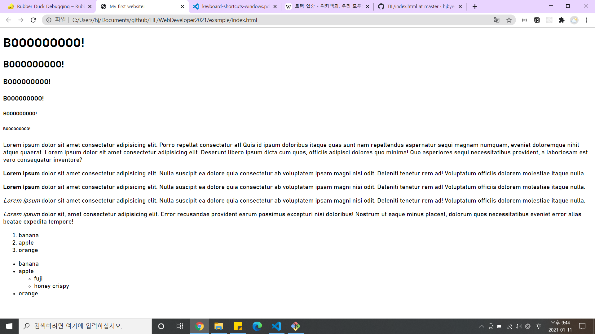
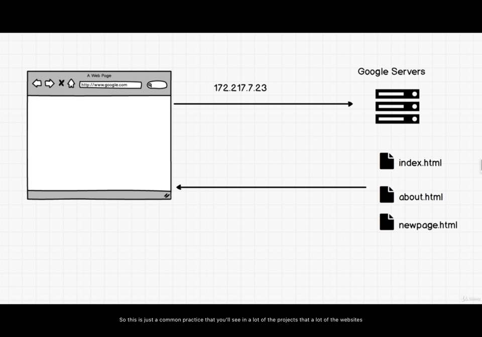

### 1. Build Your First Website
   - text editor: a program that allows us to write code.
  (ex)sublime text 3, atom, ... etc
   - The set of rules that all HTML files must follow
   - [index.html](example/index.html)
``` HTML
<!DOCTYPE html>
<html>
    <head>
        <title>My First Website!</title>
    </head>
    <body>
        Helloooooooooo there.
    </body>
</html>
```
  - server: the browser to load up the HTML
    => '서버와 통신을 통해 웹이 작동하는 것과 유사한 실습을 해봤음'의 의미. 로컬에서 HTML파일을 생성하여, 브라우저(ex.Chrome)이 HTML 파일을 보여주는 것 - 브라우저 주소창을 보면, 로컬 경로의 HTML파일의 경로임을 확인할 수 있음.
  - tag(ex.head tag, body tag)
  - tag: opening(ex.<head>) and closing(ex.</head>)

### 2. Resources: Your Text Editor
  - Atom
  - Visual Studio Code

### 3. DEVELOPER FUNDMENTALS: Ⅲ
  - "!DOCTYPE html": to the browser, 'Hey browser we're going to be using HTML5. so please make sure that you load the website properly'
  - a concept across that as a developer, you want to understand how things work and what they mean.
  - Use 'Google'

### Quick Note About w3schools
  - [w3schools](https://www.w3schools.com/): resource when getting started
  - [MDN](https://developer.mozilla.org/ko/): resources for developers, by developers

### How to ask questions
1. Try [Rubber Ducking](https://rubberduckdebugging.com/)
2. Use google and websites like [stackoverflow](https://stackoverflow.com/)
3. Our discord community
4. if all else fails, look to see if others have posted similar questions in the QA.

### HTML Tags
  - everything is surrounded by a tag
  - "h1" tag: header. h1(size) to h6.children of the 'body' tag -> Use h1 to h6 elements only for headings Do not use them just to make bold or big. use another tag
  - "p" tag: paragraphs.
  - "body" tag: 'nested tags'. body is the parent and.
  - editor관련: lorem(표준 채우기 텍스트)입력 + tab -> 자동 채워짐
  - "b" tag: bolding and bigger.emphasize on letters.
    - Now this syntax is actually not used anymore, or is not recommended. obviously still works.-a problem that HTML was initially used for websites that ran on computers, on PCs, on Macs. and now we have things such as mobile phones and iPads, although the bold text, and we actually have another one which was the italicised,'i' tag although we had this, for most phones - some of them didn't have the ability to bold the text,and didn't have the ability to italicise. -> "strong" tag, "em" tag - evolved tag
  - tag and element
    - boday tag, h1 tag, p tag, etc -> syntax tag
    - when it's an entire block of functionality with content inside
```html
  <p></p> #p tag, p tag를 언급 하는 것
  <p>Somthing contents</p> # p element, <p>태그포함 Somthing contests까지 포괄하는 것
```
### HTML tags2
 - "ol" tag: ordered list. with numbers
   - "li" tag: within ol tag
 - "ul" tag: Unordered list
 - ol, ul, li are all about nesting, and having parent tags, and children tags.


### Self Closing HTML Tags
  - <tag_name>: opening, </tag_name>: closing
  - a few elements that don't have this syntax but they have something called 'self-closing tags';
  - (ex)br, hr, img
  - just have one single element, self-closing
  - (ex)"br /" syntax -> old version. xHTML
  - some HTML tags can have something called attributes, which add special properties to the specific tag. (ex)img -> src(=sorce). an attribute alwasy has a value attached.

### Anchor Tag
  - power of HTML is in its ability to link to other document.
  - anchor tag - "a tag", opening and closing tags
  - 'href' is an attribute and it'sthe hypertext reference.
  - ability to link to other pages.

### Q&A: index.html
(ex)

  - Q: how does the server know which html(file) to return first for the homepage?
  - A: By default most servers return 'index.html' if they see 'index.html'
  - A: This is a common practice that you'll see in a lot of the projects that a lot of the websites is that 'index.html' is usually, you can think of it as the home-page, the first a HTML file

### Q&A: Relative vs Absolute Path
  - Q:index.html, newpage.html a tag에 생성할 때, .html로 경로 설정 종료. 사실상 로컬의 Documents/../index.html의 경로를 가지고 있지만 그걸 표기하지 않음 vs img tag에서 구글링한 이미지의 소스 주소 -> 전체 주소 그대로.https~ - 이 두 방식의 차이란 무엇인가
  - A: Using the file protocol. a tag의 사용방식 - relative path. a tag newpage예시 -> index.html has relative path to newpage.html. 만약 index.html파일이 있는 경로에서 test 폴더 생성 후, 해당 폴더 안에 newpage.html을 넣어둔다면, a tag의 path는 'test/newpage.html'로 변경되어야 한다.
  - A: Absolute path. img tag we are accessing the image through http, which we'll get into later video when we talk about servers.
    - https protocol
    - No matter where I reference this link will get me link page