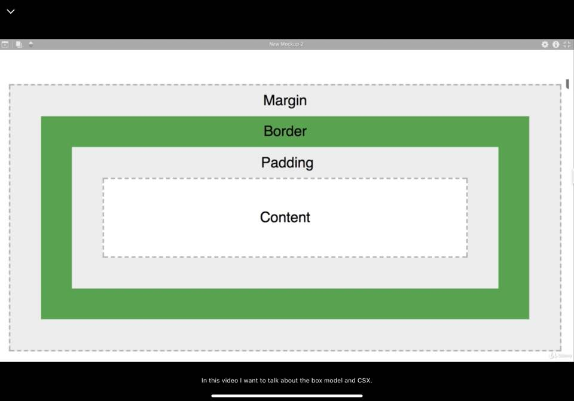

### Your First CSS
- inner designer <-CSS
- link to style sheet(CSS file)
- link tag allows us to link this html file to somthing else
- rel: stylesheet, type: media type, href: link address
- cascading means that it always take the selector that is at the end and that's simplified terms but I want to demonstrate for you what that means.
- trickles down and cascades
```css
/*해당 스타일을 적용한 페이지의 <p>값 색상은 그린으로 보여짐. */
h2 {
    color: red;
}
p {
    color: pink;
}
p {
    color: green;
}
```
- inline style and others.(CSS(style) 사용 방법)
```css
/*1. CSS 파일 생성 - link 연결*/
<link rel="stylesheet" type="text/css" href="style.css">
/*2. inline style: tag element에 포함*/
<header style="background-color: green; color:red;">
/*3. Style(CSS) 자체 삽입*/
<style>
    li {
        background-color: purple;
        color: white;
    }
</style>
```
- web sites bigger and massive. CSS code more and more. -> seperate CSS
- HTML just worry abount text, CSS just worry about styles.
- seperation of concerns
### CSS Properties
- properties: we want to change within a web page
- 참고: [CSS Tricks](https://css-tricks.com/almanac/)
- specific we trickle down to smaller elements.
- [bunch of colors](https://paletton.com/#uid=1000u0kllllaFw0g0qFqFg0w0aF)
- hex,rgb,rgba etc...
- rgba - 4th elements -> transparent(?).
### CSS Selectors
- CSS Cheat Sheet
  - https://www.w3school.com/cssref/css_selectors.asp
  - https://css-tricks.com/almanac/
- Cascading Style Sheets at the most basic level it indicated that the order of CSS rules matter.
- .class is a good way to select a group of elements and make sure that they all have same things
- #id is similar to class except for you can use the same ID only once
- * is not used very often but it symbolizes all elements. often use in the top
- element space element
- element, element
- element > element
- element + element
- :last-childe
- :first-child
- !important (not recommended): overrides any of the cascading rules(breaks rule of the cascading style)
- What selectors win out in the cascade deoebds on
  - Specificity [(참고)](https://specificity.keegan.st/)
  - Importance
  - Source Order
### Optional Exercise: CSS Selectors(article)
- [CSS Selector Game](https://css-diner.netlify.app)
### Text and Font
- text-decoration
### Images In CSS
- float
- footer - clear
### Box Model
- 
```css
padding: 5px 20px 5px 20px
=padding: top right bottome left
padding-top: 5px
margin: 0px 20px 0px 20px;
=margin: top right bottome left
margin: 0px 20px;
margin: tom&bottom left&right;
```
### px vs em vs rem
- em: stays relative th the p one other one. -> 속한 태그의 크기 속성의 크기 배수만큼 보임
- (EX) span안의 Lorem ipsum은 기타 P 태그 내용 폰트 크기의 5배. 해당 예시의 경우 span의 폰트 사이즈 100px과 동일함.
```html
<p>Introduction</p>
<p><span>Lorem ipsum</span> dolor sit amet</p>
```
```css
p {
    font-size: 20px;
}
span {
    font-size: 5em;
}
```
- rem: size in relation to root element(HTML).
### Exercise: CSS Quiz
- [Practice_CSS](https://www.w3schools.com/css/exercise.asp)
  - 2021.01.20 진도체크: 8/138 
- [Reference](https://zero-to-mastery.github.io/resources/)