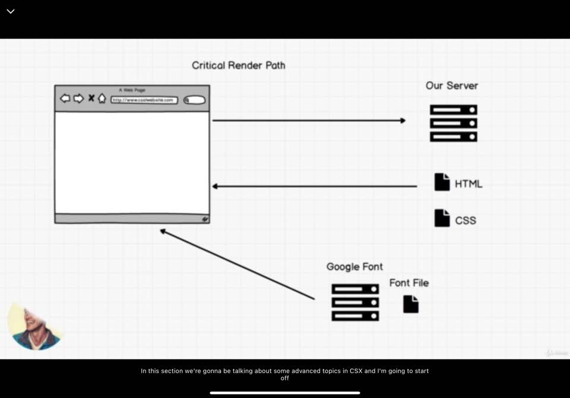
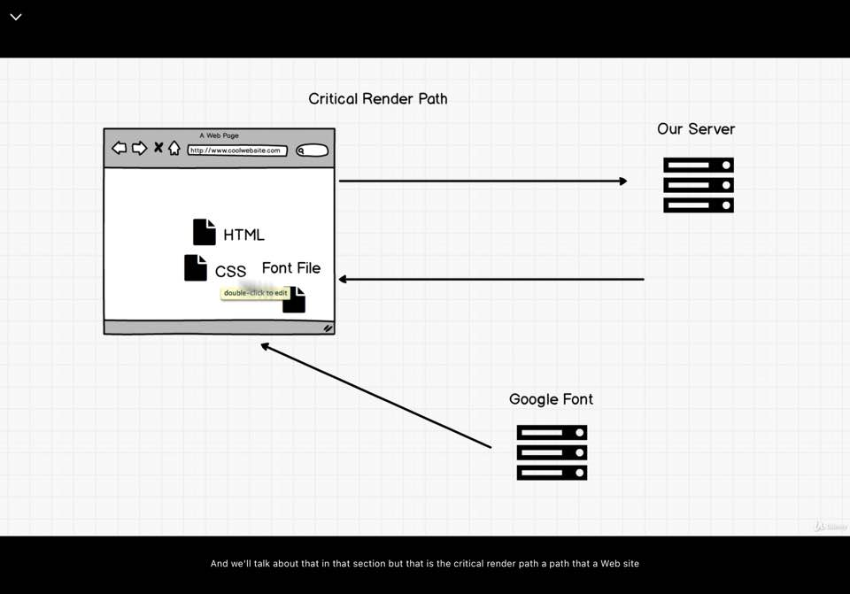

### Critical Render Path

- critical render path: CSS is their render blocking file
    - you won't be able to render a web page until you recieve you CSS
- [CSS Minify](https://www.cleancss.com/css-minify/)

### Exercise: Codde-along Images

### FlexBox
Let's build a fun image portfolio site

### Optional Exercise: FlexBox Froggy
- [Flexbox Froggy](https://flexboxfroggy.com/)
- [resources](https://darekkay.com/dev/flexbox-cheatsheet.html)